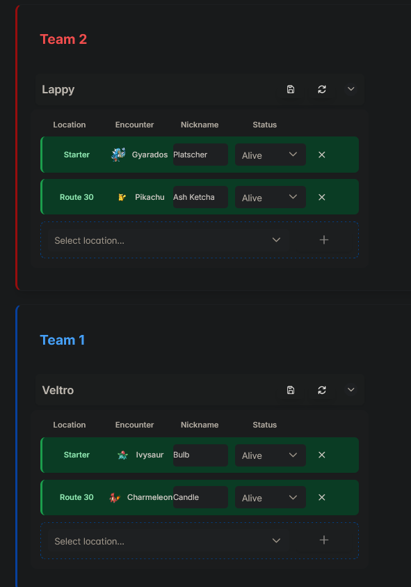
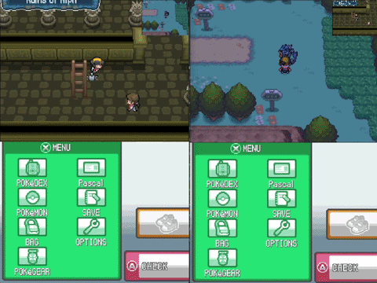
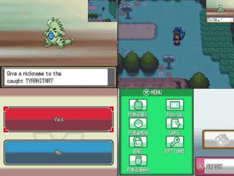
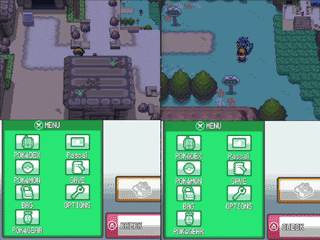

# SoulBud
A Pokémon SoulLink application that automatically tracks gameplay and battles, synchronizing encounters, Pokémon, and SoulLink partners in real time.

## Features

### Automatic Nuzlocke & SoulLink Tracking

No need to manually edit a Nuzlocke or SoulLink tracker: Automatically reads data directly from the game and writes them into the online tracker (https://soullocke.com - I am not affiliated with their website in any way).

### In-Game Event Messages

Receive messages directly inside the game for important events. This includes actions from your SoulLink partner or Nuzlocke rule notifications.

  
  &nbsp;&nbsp;&nbsp;&nbsp;&nbsp;
  

### Partner Stream in the Emulator (Only works in the same local network)

Watch your SoulLink partner's game inside your emulator if you'd like to.

  

## Installation & Setup
- Download the latest release from the release tab (The "Soulbuddy.zip" file)
- Unzip the folder somewhere on you computer
- Run DeSmuMe, start the game and load a savegame
- In the DeSmuMu menu click on Tools -> Lua Scripting -> New Lua Script Window
- Click on "Browse" and go to the folder you just unpacked.
- Select the file "soulbuddy_all.lua" in: collectors -> desmume-gen4 -> soulbuddy_all.lua
- Wait for Soulbuddy to start
- Setup the tracker link by visiting the website [Soullocke](https://soullocke.com) and create a run (Only Heartgold & Soulsliver work at the moment).
- Set the same Username that you use in the tracker (Soullocke), paste the link and also the password
- Enjoy!

